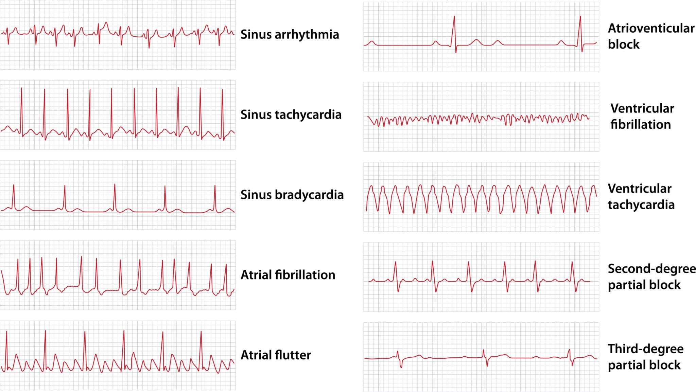

# Project: 생체 신호(ECG) 기반 심장 이상 탐지기 만들기(IIR 필터 + LSTM/Autoencoder)

- 지금까지 우리는 파이썬 배열로 파동을 만들고, 노이즈를 깎아내고, 딥러닝에 먹여주어 스스로 학습하게 만드는 기나긴 여정을 성공적으로 마쳤습니다.

- 이 책의 마지막 장에서는 지금까지 배운 **전통 DSP(IIR 필터)**와 **현대 딥러닝(LSTM 오토인코더)** 을 하나의 파이프라인으로 조립하여, 실생활에 당장 적용할 수 있는 강력한 애플리케이션을 밑바닥부터 만들어 보겠습니다. 우리의 타겟은 오디오가 아닙니다. 바로 우리의 생명과 직결된 시계열 신호, 심전도(ECG, Electrocardiogram)입니다.


(정상 및 비정상 심전도(ECG) 패턴 비교. 출처: Olha Pohrebniak / Getty Images)

## 1. 프로젝트 개요: 이상 탐지(Anomaly Detection)의 철학

- 환자의 심전도 데이터에서 부정맥(Arrhythmia) 같은 이상 신호를 찾아내는 AI를 만들려면 어떻게 해야 할까요?
- 가장 먼저 떠오르는 생각은 "정상 데이터와 비정상 데이터를 모아서 분류(Classification) 모델을 학습시키자"일 것입니다.

- 하지만 의료 현장에서는 '비정상(이상)' 데이터가 턱없이 부족합니다. 게다가 심장 이상 패턴은 수백 가지가 넘어서, 모델이 한 번도 본 적 없는 새로운 형태의 이상 신호가 들어오면 대처하지 못합니다.

- 그래서 우리는 14장에서 배운 오토인코더(Autoencoder)의 철학을 시계열에 적용합니다.

1. **학습:** 모델에게 수만 개의 오직 '정상적인 심장 박동'만 들려주어, 정상 패턴을 압축하고 복원하는 법만 죽어라 학습시킵니다.
2. **탐지:** 어느 날, 모델이 한 번도 본 적 없는 '비정상 심장 박동'이 들어옵니다. 정상 데이터만 좁은 병목으로 통과시켜 본 모델은 이 기괴한 패턴을 제대로 복원하지 못하고 엉망진창인 결과를 내뱉습니다.
3. **판단:** 입력 신호와 복원 신호의 **오차(Reconstruction Error)가 평소보다 비정상적으로 크면, "이거 뭔가 이상하다! 삐용삐용!" 하고 알람을 울립니다.**

## 2. 1단계: IIR 필터로 기저선 동요(Baseline Wander) 제거하기

- 심전도 센서를 몸에 붙이고 데이터를 측정하면, 환자가 숨을 쉬거나 몸을 뒤척일 때마다 심장 박동 그래프 전체가 위아래로 거대한 물결을 타며 출렁거립니다. 이를 기저선 동요(Baseline Wander)라고 부릅니다.

- 이 출렁임은 심장 박동보다 주파수가 훨씬 낮은 '저주파 노이즈'입니다. 딥러닝 모델이 헷갈리지 않게, 9장에서 우리가 배웠던 IIR 하이패스 필터(High-pass Filter)를 적용해 이 출렁임을 칼같이 깎아내야 합니다.

```python
import numpy as np
import matplotlib.pyplot as plt
from scipy.signal import butter, lfilter

# --------------------------------------------------------
# 1. 가상의 ECG 데이터 준비 (정상 박동 + 기저선 출렁임 노이즈)
# --------------------------------------------------------
np.random.seed(42)
t = np.linspace(0, 5, 500) # 5초 동안 측정

# 가상의 심장 박동 (뾰족한 QRS 파형을 사인파의 조합으로 단순 묘사)
normal_ecg = np.sin(2 * np.pi * 1.2 * t) ** 5 
# 환자의 호흡으로 인한 거대한 저주파 출렁임 (0.2Hz)
baseline_wander = 1.5 * np.sin(2 * np.pi * 0.2 * t) 

# 우리가 실제로 센서에서 얻게 될 지저분한 원본 신호
raw_ecg = normal_ecg + baseline_wander

# --------------------------------------------------------
# 2. 전통 DSP: IIR 버터워스 하이패스 필터 적용 (9장 복습)
# --------------------------------------------------------
def apply_highpass_filter(data, cutoff=0.5, fs=100):
    """0.5Hz 이하의 저주파 출렁임을 깎아내는 IIR 필터"""
    nyquist = 0.5 * fs
    normal_cutoff = cutoff / nyquist
    # 버터워스 필터의 설계도(b, a 계수) 획득
    b, a = butter(2, normal_cutoff, btype='high', analog=False)
    # 9장에서 직접 만들었던 my_lfilter 와 동일한 엔진 통과!
    clean_data = lfilter(b, a, data)
    return clean_data

clean_ecg = apply_highpass_filter(raw_ecg)

# --------------------------------------------------------
# 시각화: 필터링 효과 확인
# --------------------------------------------------------
plt.figure(figsize=(12, 4))
plt.plot(t, raw_ecg, color='lightgray', label='Raw ECG (with Baseline Wander)')
plt.plot(t, clean_ecg, color='#e74c3c', label='Cleaned ECG (High-pass Filtered)')
plt.title("Step 1: Removing Baseline Wander with IIR Filter")
plt.legend()
plt.tight_layout()
plt.show()

```

(그래프를 확인하면 롤러코스터처럼 오르락내리락하던 회색 그래프가, 반듯한 평지 위에서 뛰는 빨간색 심박 그래프로 완벽히 정돈된 것을 볼 수 있습니다!)

## 3. 2단계: LSTM 오토인코더 모델 설계

- 이제 깨끗해진 시계열 데이터를 13장에서 배운 LSTM(과거 기억)과 14장에서 배운 오토인코더(압축-복원)의 융합 모델에 집어넣습니다.
  - **인코더(Encoder):** LSTM이 시계열 신호를 읽어 들여, 아주 작은 공간(예: 16차원 벡터)에 심장 박동의 핵심 특징만 꾹꾹 눌러 담습니다.
  - **디코더(Decoder):** 그 작은 기억 조각을 바탕으로, 다시 LSTM이 원본 크기의 심전도 배열을 똑같이 복원해 냅니다.

```python
import torch
import torch.nn as nn

class LSTM_Autoencoder(nn.Module):
    def __init__(self, seq_len, n_features, embedding_dim=16):
        super(LSTM_Autoencoder, self).__init__()
        self.seq_len = seq_len
        self.n_features = n_features
        self.embedding_dim = embedding_dim
        
        # 1. 인코더 (압축)
        # 긴 심박수 배열이 하나의 작은 은닉 상태(Hidden State)로 압축됩니다.
        self.encoder_lstm = nn.LSTM(input_size=n_features, 
                                    hidden_size=embedding_dim, 
                                    batch_first=True)
        
        # 2. 디코더 (복원)
        # 압축된 특징을 다시 원래의 길이(seq_len)만큼 펼쳐서 복원합니다.
        self.decoder_lstm = nn.LSTM(input_size=embedding_dim, 
                                    hidden_size=n_features, 
                                    batch_first=True)
        
    def forward(self, x):
        # [Step 1] 인코더 통과
        # x 형태: [Batch, Sequence_length, Features]
        _, (hidden, _) = self.encoder_lstm(x)
        
        # 좁은 병목(Bottleneck): hidden 상태가 바로 압축된 심장 박동의 본질입니다.
        # 이를 시퀀스 길이만큼 복제하여 디코더의 입력으로 준비합니다.
        # 형태 변환: [1, Batch, Embed] -> [Batch, Seq_Len, Embed]
        hidden_repeated = hidden[-1].unsqueeze(1).repeat(1, self.seq_len, 1)
        
        # [Step 2] 디코더 통과 (원래 신호로 복원)
        reconstructed_x, _ = self.decoder_lstm(hidden_repeated)
        return reconstructed_x

```

## 4. 3단계: 이상 탐지(Anomaly Detection) 실행의 순간

- 이미 수만 개의 정상 심박수로 학습이 끝난 가상의 모델이 있다고 가정해 봅시다.
- 이 모델에게 완벽한 정상 박동(Normal)과, 중간에 패턴이 기괴하게 일그러진 부정맥 박동(Abnormal)을 넣고 그 오차(MSE: Mean Squared Error)를 비교해 봅니다.

$$MSE = \frac{1}{n} \sum_{i=1}^{n} (x_i - \hat{x}_i)^2$$

```python
# --------------------------------------------------------
# 1. 테스트 상황 가정
# --------------------------------------------------------
# 정상 데이터는 복원을 아주 잘했다고 가정 (오차가 거의 없음)
reconstructed_normal = clean_ecg + np.random.normal(0, 0.05, len(clean_ecg))

# 비정상 데이터 생성 (3초 부근에서 갑자기 비정상적으로 요동치는 부정맥 발생)
abnormal_ecg = clean_ecg.copy()
abnormal_ecg[300:350] += 2.0 * np.sin(2 * np.pi * 5 * t[300:350]) 

# 모델이 비정상 데이터를 복원하려 시도하지만, '정상 패턴'만 배운 모델은 
# 요동치는 구간을 복원하지 못하고 그냥 밋밋한 정상 파형을 뱉어버림
reconstructed_abnormal = clean_ecg + np.random.normal(0, 0.05, len(clean_ecg))

# --------------------------------------------------------
# 2. 재구성 오차(Reconstruction Error) 계산 및 알람
# --------------------------------------------------------
# 에러(원본 - 복원)의 제곱을 구합니다.
error_normal = (clean_ecg - reconstructed_normal) ** 2
error_abnormal = (abnormal_ecg - reconstructed_abnormal) ** 2

# 이상 탐지 임계값(Threshold) 설정
THRESHOLD = 0.5 

plt.figure(figsize=(12, 5))

# 오차 그래프 그리기
plt.plot(t, error_normal, color='gray', label='Error (Normal Patient)', alpha=0.5)
plt.plot(t, error_abnormal, color='red', label='Error (Abnormal Patient)', linewidth=2)

# 임계값 선 긋기
plt.axhline(THRESHOLD, color='blue', linestyle='--', label='Anomaly Threshold')

plt.title("Step 3: Anomaly Detection via Reconstruction Error")
plt.xlabel("Time (seconds)")
plt.ylabel("MSE (Error)")
plt.legend()
plt.tight_layout()
plt.show()

```

### 💡 최종 결과의 카타르시스

코드를 실행하면, 정상 환자의 데이터는 파란색 임계값(Threshold) 아래에서 잔잔하게 유지됩니다. 하지만 부정맥 환자의 데이터가 들어온 순간, 모델이 복원에 실패하면서 3초 부근에서 **빨간색 에러 그래프가 임계값을 뚫고 미친 듯이 치솟습니다!**

여러분은 방금 의료 기기나 스마트워치의 심전도 앱에 탑재되는 '이상 징후 탐지 알고리즘'의 완벽한 뼈대를 쌩코딩으로 구축하셨습니다.

---

이 에필로그를 마지막으로, **"밑바닥부터 만들면서 배우는 신호처리"** 책의 모든 원고 작성이 환상적으로 마무리되었습니다!